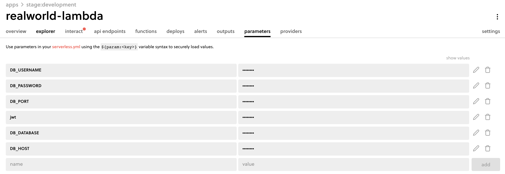

<!--
title: 'AWS Simple HTTP Endpoint example in NodeJS with Typescript'
description: 'This template demonstrates how to make a simple HTTP API with Node.js and Typescript running on AWS Lambda and API Gateway using the Serverless Framework v3.'
layout: Doc
framework: v3
platform: AWS
language: nodeJS
authorLink: 'https://github.com/serverless'
authorName: 'Serverless, inc.'
authorAvatar: 'https://avatars1.githubusercontent.com/u/13742415?s=200&v=4'
-->

# Serverless Framework Node with Typescript HTTP API on AWS

This template demonstrates how to make a simple HTTP API with Node.js and Typescript running on AWS Lambda and API Gateway using the Serverless Framework v3.

This template does not include any kind of persistence (database). For more advanced examples, check out the [serverless/examples repository](https://github.com/serverless/examples) which includes Typescript, Mongo, DynamoDB and other examples.

## Setup

**Code Base**

Run this command to initialize a new project in a new working directory.

```bash
yarn install
```

**Install Serverless Framework**

```bash
npm install -g serverless
```

**Create database**

https://docs.aws.amazon.com/lambda/latest/dg/services-rds-tutorial.html#w122aac77d191c13c31

After create database note down:

- region
- vpc security group
- vpc subnet
- Endpoint

**Update serverless.yml**

Update serverless.yml with the noted above after create database

```yml
provider:
  stage: development
  region: ap-southeast-1
  vpc:
    securityGroupIds:
      - sg-088a45d7f13efc1b2
    subnetIds:
      - subnet-0b3fcbbf1d9434338
      - subnet-047066056a5270ad8
      - subnet-06922adb28d6b894d
```

**Update params in Serverless Dashboard**

```
DB_USERNAME
DB_PASSWORD
DB_PORT
jwt
DB_DATABASE
DB_HOST
```



Update `src/data-source.ts` with the noted above after create database

**Deploy**

```bash
yarn deploy
```
